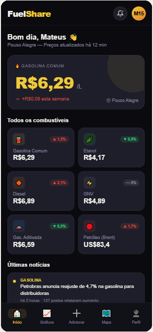

# ⛽ Fuel-Share

> A modern, mobile-first web application engineered for real-time fuel price monitoring and localized analytics. Developed as a high-performance portfolio project to demonstrate clean code, responsive design, and state management.

**Fuel-Share** addresses a real-world problem: helping users optimize their daily commute expenses. Featuring a sophisticated *Dark Premium* dashboard optimized specifically for mobile viewports, the application dynamically manages user preferences and calculates metadata context entirely on the client side.

---

## 📸 Production Preview

<div align="center">
  
  <p><em>Sleek Dark Premium interface optimized for mobile devices (#1c1c1c ecosystem).</em></p>
</div>
---

## 🛠️ Core Architecture & Features

This project was built focusing on **clean code, separation of concerns, and visual hierarchy**, demonstrating production-ready frontend skills:

* **Dynamic 'Fuel-Hero' Component:** An isolated UI section that acts as the primary display, dynamically adapting its content based on the user's primary fuel preference (Gasoline, Ethanol, or Diesel).
* **Asynchronous Time-Elapsed Engine:** A JavaScript utility that computes time intervals from data entry timestamps, updating the DOM dynamically (*e.g., "Updated 15 min ago"*, *"2 days ago"*).
* **Smart Trend Analysis Badges:** State-driven visual hooks (`▲` or `▼`) that automatically manipulate CSS classes (`.up` / `.down`) to shift color contrast dynamically based on market volatility.
* **Glassmorphic UI Design:** A tailored background color (`#1c1c1c`) layered with subtle opacities and sharp borders (`rgba(255, 255, 255, 0.08)`) ensuring depth, premium look, and reduced eye strain.

---

## 💻 Tech Stack & Engineering Practices

Built natively using core vanilla web technologies to guarantee absolute performance, minimum bundle size, and fast rendering times:

* **HTML5:** Semantic architecture clean-cut into responsive layouts (`card-top`, `price-container`, `card-bottom`).
* **CSS3 Modern Layouts:** Advanced usage of **Flexbox** positioning, centralizing layout control using CSS Native Variables (`var(--card-bg)`), and box-shadow depth layers.
* **JavaScript (ES6+):** Deep DOM manipulation, conditional styling hooks, and automated date-subtraction logic using the native `Date()` object.

---

## 🔍 Code Review & Structure

For enterprise evaluation, the core codebase, UI components, and state logic can be found under the source directory:

```text
├── Fuel-Share/
│   ├── assets/
│   │   ├── brand/                  # Logos, badges and visual identity assets
│   │   ├── icon/                   # App icons and PWA favicons
│   │   └── images/
│   │       └── Production-preview.png  # Application visual mockup
│   └── src/
│       ├── index.html              # Semantic structure & DOM entry point
│       ├── main-style.css          # Custom Dark Premium theme & Flexbox layout
│       └── script.js               # Core business logic & Time-Elapsed algorithm